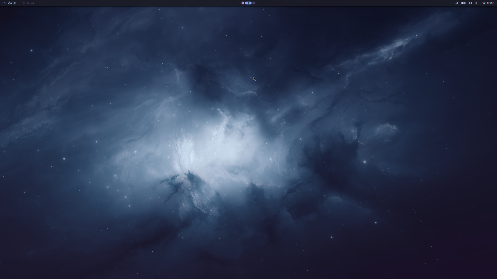

# my dotfiles

Using [chezmoi](https://www.chezmoi.io/) to manage my dotfiles between different machines:
- laptop (framework 16 first gen - archlinux)
- work (macbook m2)
- wsl (archlinux wsl)

## desktop features

- niri
- noctalia shell

